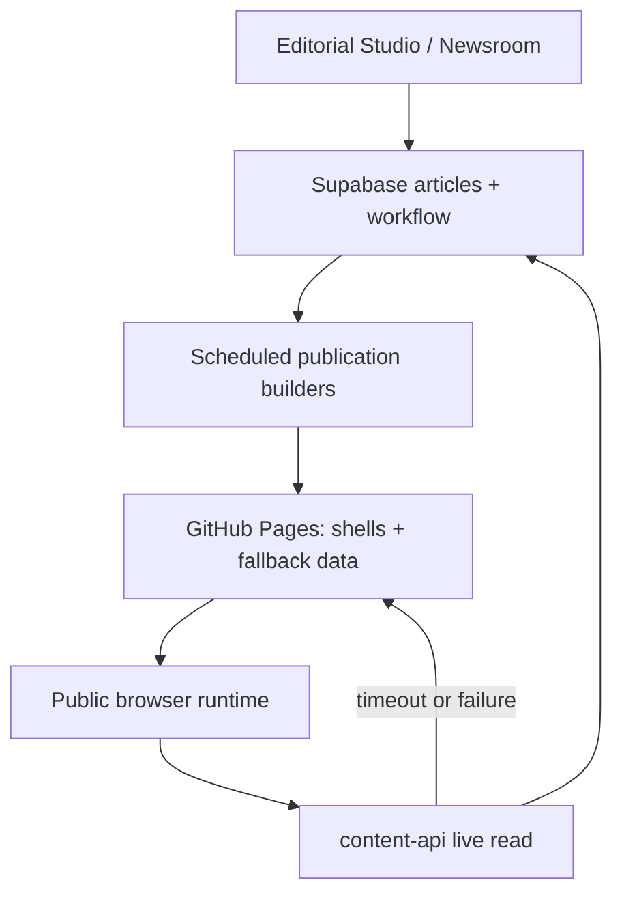

# Neural Critic overhaul baseline

- Last audited: 2026-09-02
- Baseline commit: `ddb6aa88bdd76756c85beb06627fc95dac261023` (`main`)
- Milestone branch: `overhaul/baseline-regression-safety`

## Purpose and verification language

This document is the architecture and regression contract for the Neural Critic overhaul. It describes what exists before any redesign and identifies the paths future milestones must preserve.

The words **present**, **rendered**, and **verified** are not interchangeable:

- **Present** means code, markup, a database object, or a control exists.
- **Rendered** means a representative page produced the expected user interface in a browser.
- **Verified** means the complete journey succeeded, including the real API/database operation and a reload check when persistence is claimed.
- A static audit can protect structure and wiring, but it cannot prove authenticated persistence, third-party delivery, or production authorization policy by itself.

No system should receive a “complete” capability status solely because this inventory names it.

## Architecture overview

Neural Critic is a framework-free GitHub Pages publication with a Supabase-backed live data plane and a generated same-origin fallback. Public pages are HTML/CSS/JavaScript. The browser uses the Supabase JavaScript client, but `assets/content-api.js` intercepts article fallback requests and first attempts published rows from Supabase. If the live request times out or fails, the existing `data/articles.json` and `data/articles/<slug>.json` files remain available.

Canonical articles are generated directories at `/stories/<slug>/`. Each shell carries crawler-readable metadata and schema, then hydrates the same runtime used by `article.html?slug=<slug>`. The query-string URL remains a compatibility/runtime route; it is not the canonical public URL.

Editorial Studio, Newsroom Operations, and Subscriber Desk are private/noindex browser applications backed by Supabase. Scheduled GitHub Actions regenerate canonical stories, topic hubs, game pages, author hubs, sitemap, RSS, robots, and fallback data from the publication source. Commerce ingestion and newsletter delivery use server-side workflows or Edge Functions; privileged keys must never enter public assets.



## Runtime and canonical contracts

1. Public article links resolve to `/stories/<slug>/`.
2. Every published fallback row has exactly one `data/articles/<slug>.json` file and one `stories/<slug>/index.html` shell.
3. The canonical shell contains a clean `https://www.neuralcritic.net/stories/<slug>/` canonical, social metadata, JSON-LD, a static slug marker, and the shared article runtime.
4. `article.html?slug=<slug>` remains a supported compatibility route.
5. `assets/story-router.js` owns clean-link/canonical routing compatibility through `window.NeuralCriticStoryRouter`. Runtime bootstrap must load that contract before `public-hardening.js`, and later metadata writers must consume its clean story URL rather than derive a competing canonical. Do not introduce a competing router.
6. `assets/article-runtime-integrity.js` is the single owner for Reading Map navigation behavior. Other modules may build or style the map but must not register a competing navigation owner.
7. `assets/content-api.js` owns live-Supabase-first/fallback-data behavior. Do not bypass it with a second article fetch architecture.
8. `assets/local-assets.js` localizes recoverable editorial media URLs and must not duplicate already-present runtime modules.

## System inventory

### Public publication and navigation

| System | Entry points and public surfaces | Important files | Dependencies and data source | Events / API calls | Regression risks |
|---|---|---|---|---|---|
| Homepage | `/`, `index.html`; lead, secondary, latest feed, curated desks, What to Play, trending, newsletter, commerce slots | `index.html`, `assets/app.js`, `home-feed.js`, `home-curation-guard.js`, `curated-collections.js`, `home-what-to-play.js`, `popularity-signals.js`, `home-commerce.js` | Published `articles`; Discovery Intelligence; popularity RPC; commerce tables; generated fallback | Fetches article fallback intercepted by `content-api`; `get_article_popularity`; click tracking; newsletter submit | Many independent enhancers mutate the same feed. Load order, delayed live data, duplicate injection, and fallback/live divergence are high risk. |
| Global header/navigation | Shared header injected by public runtime; desktop dropdowns, mobile navigation, category/game/search links, account and theme controls | `assets/app.js`, `publication-nav.js`, `header-polish.css`, `publication-nav.css`, `public-responsive.css`, `public-accessibility.js` | Page DOM, route state, reader/auth extensions | Click, keydown, focus, mobile-menu and theme storage interactions | Header is shared across unrelated templates. Duplicate script loading previously occurred when a static script lacked the loader marker; source-aware guards must wait until later static markup is parsed. |
| Footer | Shared footer host on public templates; policy, editorial, RSS, newsletter links | `assets/app.js`, page `#shared-footer` hosts, `newsletter.js` | Static navigation plus newsletter Edge gateway | Newsletter submit; navigation clicks | Missing host elements or app bootstrap failures remove the footer across many pages. |
| Categories | `category.html?section=<desk>` for News, Reviews, Guides, Features and related desks; `category=<desk>` remains a legacy alias | `category.html`, `assets/app.js`, `category-parity.js`, `category-news.js`, `category-editorial-v3.js`, category CSS layers | Published articles, category/editorialSection fields, popularity and curated collection enhancers | Fallback/live article fetch; filter and card clicks | Query parameter conventions (`section` versus legacy `category`), several styling/behavior layers, and category-specific layout assumptions. |
| Global search | `search.html?q=<query>`; header search and result filtering | `search.html`, `assets/app.js`, `search-parity.js`, `discovery-intelligence.js` | Published article fallback/live source; Discovery search index | Search form submit/input; analytics records query length, not query text | Search depends on article hydration and normalized metadata. Do not send raw reader queries to analytics. |
| Reviews directory | `/reviews/` and review cards/score surfaces | `reviews/index.html`, `assets/review-intelligence.js`, `review-score-reactor.js`, `review-parity.js` | Published review articles and `reviewMeta` | Filter/sort; article navigation | Review scoring has both data and presentation contracts. Missing score/verdict/pro/con data can leave apparently valid but incomplete cards. |
| Author hubs | `/authors/<slug>/` plus author links/bylines | `author.html`, generated `authors/**/index.html`, `author-system.js`, `build_author_pages.py` | Published article authors; fallback/live data | Article navigation; author follow controls when auth extensions load | Generated route count and byline identity must stay aligned; author follow is a separate persistence path. |

### Articles, formats, discovery, and recirculation

| System | Entry points and public surfaces | Important files | Dependencies and data source | Events / API calls | Regression risks |
|---|---|---|---|---|---|
| Article runtime | `article.html?slug=...` and hydrated canonical shells; title, deck, byline, hero, body, Reading Map, share/follow/community rails | `article.html`, `assets/app.js`, `content-api.js`, `article-extras.js`, `article-runtime-integrity.js`, `article-formatting.js`, `article-polish.js`, `article-sidebar-interactive.js` | Live published `articles` with generated JSON fallback; local/remote editorial media | Article fetch; share/clipboard; scroll/hash navigation; enhancer DOM events | Most sensitive runtime. It is layered and timing-dependent. A shell can look valid before async content, discovery, auth, or community modules finish. |
| Canonical story shells | `/stories/<slug>/`; crawler-readable canonical, Open Graph, Twitter, Article/Breadcrumb schema | `stories/**/index.html`, `build_story_pages.py`, `enrich_story_metadata.py`, `story-router.js`, `publication_config.py` | Published article rows; `article.html` template; production site origin | History compatibility rewrite to `article.html?slug=...`; canonical remains clean | Template or base-path changes can break all stories. Generated files, data files, sitemap, and runtime index must remain exact sets. |
| Standard articles | Current fallback: 25 | `data/articles*.json`, `article-extras.js`, formatting/editorial modules | Body plus `contentBlocks`, quick read/conclusion/news metadata | Shared article events and APIs | “Standard” spans news/features and should not be treated as a blank format. Optional structured metadata drives additional surfaces. |
| Reviews/scoring | Current fallback: 9 | `review-parity.js`, `review-score-reactor.js`, `review-intelligence.js`, Studio review fields | `reviewMeta` score, verdict, pros, cons, platform/developer/publisher/release fields | Score widgets; review directory discovery | Three existing reviews lack `testedPlatform`; preserve rendering while treating that metadata as incomplete. Score changes affect cards, schema, and article views. |
| Guides | Current fallback: 6 | `article-formatting.js`, Studio formatting/builders, guide article data | `articleFormat=game-guide`, ordered structured blocks | Reading Map and section navigation | Headings and block order are user navigation, not decorative markup. |
| Ranked/best lists | Current fallback: 13 | `ranked-parity.js`, `collection-ranking-preview.js`, curated collection modules | `articleFormat=ranked-list`, string/numeric ranks, collection metadata | Ranked card navigation and collection links | Rank order is structured content. Do not infer a replacement ordering from DOM position without preserving stored ranks. |
| Reading Map | Article side/inline section navigation | `article-runtime-integrity.js`, `article-extras.js`, `article-sidebar-interactive.js`, `article-reading-map-guard.css` | Rendered headings/content blocks | Anchor/hash/scroll/keyboard navigation | Single-owner invariant is deliberate; past regressions came from competing listeners and late DOM mutation. |
| Discovery Intelligence | Homepage programming, entity extraction, search, article relation scoring | `discovery-intelligence.js`, `discovery-intelligence.css`, `audit_discovery_links.py` | Article tags, category, editorial section, game/series/franchise identities, popularity | Internal scoring and DOM/render hooks | Central shared intelligence layer. A “new recommendation engine” would duplicate it and split ranking behavior. |
| Related Coverage | Article relation modules and entity-aware cards | `article-discovery.js`, `discovery-intelligence.js`, `game-graph-identity.js` | Discovery graph built from published articles | Article card navigation; follow controls may be attached | Requires enough metadata and hydrated article state; cannot be judged by an empty placeholder alone. |
| Connected Coverage | Article Game Graph trail and connected topic/game links | `article-discovery.js`, `game-graph-identity.js`, `topic-hub.js` | `gameKey`, `series`, `franchise`, generated hub routes | Internal navigation and entity follow events | Missing game records and inconsistent identity strings can create partial trails even while article rendering succeeds. |
| Recirculation | Next-read/continue-reading article modules | `recirculation.js`, `article-deep-link.js`, `discovery-intelligence.js` | Current article plus relation scores and published set | Card/click events, delayed DOM mounting | Timing and duplicate-loader guards matter; a second recirculation owner can emit duplicate cards or handlers. |
| Trending / Most Read | Homepage/popularity panels and ranking tabs | `popularity-signals.js`, popularity migration, `public-actions` Edge Function | `article_popularity_daily` via `get_article_popularity`; view events via `record_article_view` | Public Edge POST; tab and article clicks | Analytics-like mutation is anonymous but rate-limited at the gateway. UI presence does not prove view recording or ranking freshness. |

### Games, graph, topics, and follows

| System | Entry points and public surfaces | Important files | Dependencies and data source | Events / API calls | Regression risks |
|---|---|---|---|---|---|
| Games database | Supabase `games` and `game_releases`; generated fallback | Games migrations, `audit_games_database.py`, `build_game_pages.py` | Supabase public-read RLS plus generated `data/games.json` | Public selects for games/releases | Only 7 game records currently back a larger set of article identities. Do not create a parallel game catalog to fill the gap. |
| Games directory/release calendar | `/games/`; directory, filters, release views | `games/index.html`, `games-directory.js`, `games-directory.css`, `audit_games_directory.py` | Games/release tables with same-origin fallback | Supabase selects; filters/search/navigation | Remote/fallback parity and release date/platform normalization. |
| Individual game pages | `/games/<slug>/` and `game.html?slug=...` compatibility | Generated `games/**/index.html`, `game.html`, `game-page.js`, `game-page.css`, `build_game_pages.py` | Game record, releases, article identity and Discovery Intelligence | Game lookup, related article rendering, follow events | Generated route and database slug must match. Missing game records cannot be papered over with fake entries. |
| Game Graph | Article identity → game → series → franchise relationships | `studio-game-graph.js`, `game-graph-identity.js`, `discovery-intelligence.js`, `build_topic_pages.py` | Article `gameKey`, `series`, `franchise` plus games DB | Entity navigation and follow controls | Protected system. Identity renames fan out to articles, hubs, recommendations, follows, and generated paths. |
| Series/franchise/topic hubs | `/topics/game/.../`, `/topics/series/.../`, `/topics/franchise/.../`, plus `topic.html` | Generated `topics/**/index.html`, `topic-hub.js`, `topic-hub.css`, `build_topic_pages.py` | Distinct article identity values and Discovery Intelligence | Article navigation; entity-follow changes | Current build emits 72 hubs. Generated path slugging and article identity normalization are coupled. |
| Entity follows | Follow game/series/franchise/topic; Following area in account UI | `entity-follows-v2.js`, `entity-follows-polish.js`, entity-follow migration | Supabase `reader_entity_follows` with per-user RLS | Insert/delete/select; `nc:entity-follows-changed`; explicit re-read after write | Persistence must be tested after reload. Multiple legacy follow modules remain in the repository; V2 is the active contract and must not be duplicated. |
| Personalized/following feeds | Account Following section assembled from followed entities and matching articles | `entity-follows-v2.js`, Discovery/article metadata | Authenticated follows plus published articles | Follow change events and account refresh hooks | It is an account extension, not a separate global feed service. Identity metadata quality limits results. |

### Reader accounts and community

| System | Entry points and public surfaces | Important files | Dependencies and data source | Events / API calls | Regression risks |
|---|---|---|---|---|---|
| Reader authentication | Header account control; sign-up/sign-in/recovery/OAuth modal | `reader-account.js`, `reader-auth-v2.js`, `analytics-config.js`, `supabase-config.js` | Supabase Auth; reader profile record; auth extensions load after consent/runtime readiness | `signUp`, `signInWithPassword`, OAuth/recovery, `signOut`, auth-state events, `nc:reader-auth` | Base modal plus V2 upgrade is layered. Credentials, redirects, persistence, and recovery require real browser verification; static checks prove only wiring. |
| Reader profiles/avatar | Account profile editor and thread identity | `reader-account.js`, `reader-auth-v2.js`, `community-profile.js` | `reader_profiles`; Supabase Storage avatar bucket | Select/upsert/upload/delete; account/community refresh events | Base profile/storage migrations are not present in repository history, so the full RLS/storage policy cannot be reconstructed locally. |
| Comments/thread | Article Reader Thread, sorting, editing/deleting/reporting | `community-stable.js`, `community-core.js`, `community-thread-recovery.js`, `community-actions-v2.js`, `community-profile.js` | `article_comments`, `reader_profiles`, `comment_reports` | Select/insert/update/delete/report; thread recovered/refreshed events | Highest layering risk. Several compatibility modules attach listeners to a mutable thread. Parent/reply integrity and authorization must be verified with real accounts. |
| Like/Dislike/Reply/Copy | Article and comment actions in rail/thread | `community-core.js`, `community-actions-v2.js`, `community-stable.js`, `community-thread-recovery.js` | `article_reactions`, `comment_reactions`, comments; Clipboard API | Insert/delete/re-read reaction; reply insert; clipboard write | Button presence is not evidence. Required journey is action → database write → state/count update → reload → same state. Duplicate listeners can submit twice. |
| Saved content | Article Save control and Saved account section | `saved-stories.js`, saved-story migration | `reader_saved_stories` with per-user RLS; article fallback/live metadata | Select/insert/delete; `nc:saved-stories-changed`; explicit persistence re-read | Loaded as an extension outside the base profile slot so later profile rendering does not erase it. Must be reload-tested. |

### Newsletter, commerce, analytics, and SEO

| System | Entry points and public surfaces | Important files | Dependencies and data source | Events / API calls | Regression risks |
|---|---|---|---|---|---|
| Newsletter acquisition | Header/footer/article/sidebar/home forms | `newsletter.js`, `signup-hardening.js`, `public-actions` Edge Function, acquisition audit | `newsletter_subscribers`; public rate-limited Edge gateway | `subscribe_newsletter` is routed to `public-actions` POST; UI success/error | UI success must correspond to a real capture row. Anonymous write security lives at the Edge/database boundary, not in the form. |
| Newsletter operations/delivery | Private `/subscribers.html`; provider status/sync/status changes | `subscribers.html`, `subscribers.js`, `newsletter-admin` Edge Function, `NEWSLETTER_DELIVERY.md` | Admin Supabase session, subscriber table, Resend server credential | Admin bearer token; Edge `status`, `sync`, `set_status`; direct table read after admin role check | Private/noindex is not authorization. Service-role and provider credentials must remain server-only. Provider delivery cannot be proven by static CI. |
| Commerce/deals | `/deals.html`; product/offers listing and filters | `deals.html`, `commerce.js`, `commerce.css`, commerce migrations/importer/audit | Retailers/products/offers/history/article-product Supabase tables; provider feeds | Public read-only selects; outbound retailer click events | Existing system is intentionally dormant when no verified offers exist. Never add fake products, prices, or placeholder deals to make it look populated. |
| Article Where to Buy | Eligible article module; hidden when no valid offers | `article-commerce.js`, `article-commerce.css`, commercial article metadata | Article-product bindings and current verified offers | Public read-only selects; outbound click events | Empty state must stay hidden. Eligibility, expiry, currency, retailer identity, and disclosure must remain data-driven. |
| Commerce ingestion | Scheduled provider refresh/import and expiry/retention | `import_commerce_feed.py`, `refresh-commerce.yml`, `commerce-provider-health.yml`, commerce migrations | Provider catalogs/secrets in Actions, service-role server access, history/retention routines | Server-side upserts/expiry; dry-run validation | Protected. Current Amazon catalog is deliberately empty. Never expose privileged keys or hardcode provider results in client code. |
| Analytics/consent | Public page/session/article/interaction tracking | `analytics-config.js`, `analytics.js`, `monetization-config.js` | GA4 after consent; local consent/theme state | Consent update, page/event calls; records search query length only | Loading order also gates some reader extensions. Do not hide errors or broaden data collection during UI work. |
| SEO/schema | Canonical, meta/OG/Twitter, Article/Review/Breadcrumb/Organization structures | Builders, `supabase-config.js`, generated shells, `enrich_story_metadata.py` | Production origin and published metadata | Crawler-facing only | Runtime DOM cannot rescue missing server-visible metadata. Generated canonical and schema must be checked before commit. |
| Sitemap/RSS/robots | `/sitemap.xml`, `/feed.xml`, `/robots.txt` | `build_sitemap.py`, `build_robots.py`, publication audits | Published rows, production origin; RSS latest 30 | Build-time output | Exact canonical set matters. RSS intentionally caps at 30 and currently creates warnings when compared with all 53 stories. Feed build time is time-dependent. |

### Editorial operations, presentation, CI, and security

| System | Entry points and public surfaces | Important files | Dependencies and data source | Events / API calls | Regression risks |
|---|---|---|---|---|---|
| Publishing/CMS pipeline | Studio save/draft/schedule/publish → Supabase → scheduled generated publication | `studio.html`, `studio.js`, `studio-backend.js`, builders, `build-publication.yml` | Approved `editor_profiles`, `articles`, Storage, workflow metadata; localStorage is temporary edit cache only | Auth, selects/upserts/uploads, scheduled Actions commit | Source-of-truth confusion is critical. Do not replace Supabase with localStorage or edit generated shells as primary content. |
| Editorial Studio | Private `/studio.html`; formats, media, readiness, source docs, Game Graph, commercial fields | `studio-*.js/css`, `studio-backend.js`, `studio-seed.js` | Supabase Auth, `editor_profiles`, articles/storage/workflow | Editor sign-in; CRUD/publish/upload operations | Many feature layers enhance one long template. Duplicate `studio-news` loading was a baseline risk and is now guarded by path as well as marker. |
| Newsroom | Private `/newsroom.html`; operational queue, states, readiness, verification, homepage intent | `newsroom-dashboard.js`, `newsroom-guards.js`, workflow migrations | `editorial_workflow`, `articles`, approved editor session | Auth and CRUD/state transitions | Noindex/robots are crawler controls only. Database role checks and audit history are the security boundary. |
| Public/private/admin boundaries | Public reader pages; private Studio/Newsroom/Subscriber Desk; server Edge/workflows | Private HTML, `supabase-client-config.js`, `supabase-config.js`, Edge Functions, RLS migrations | Publishable key in browser; service-role/provider credentials server-side only | Auth bearer validation, editor/admin profile lookup, RLS | Base schema migrations are incomplete in this repository. Never infer that a client-hidden control is secure. |
| Light/dark mode | Theme control on public surfaces and Studio | `assets/app.js`, `site.css`, `public-light-fixes.css`, Studio light CSS, inline early theme bootstrap | `localStorage['neural-critic-theme']` | Theme click and storage/read on reload | Must verify every representative surface in both themes; inline bootstrap prevents flash and should remain early. |
| Responsive/mobile | Public and article layouts, navigation, rails, cards, forms | `public-responsive.css`, `public-scale.css`, article/category/game/commerce CSS | CSS media queries plus navigation/accessibility JS | Mobile navigation and touch/click/keyboard | Layered CSS uses many overrides. Desktop success does not prove mobile reading order, overflow, or tap targets. |
| Accessibility | Skip/focus/labels/alt text, keyboard nav, reduced motion, semantic landmarks | `public-accessibility.js`, `performance.js`, responsive CSS, article data `imageAlt` | DOM semantics and editorial metadata | Keydown/focus/escape; reduced-motion preference | Automated markers are necessary but not a screen-reader or full keyboard audit. Generated and async UI must preserve labels/focus states. |
| GitHub Actions | Publication build/health, commerce refresh/health, image localization, social preview | `.github/workflows/*.yml` | GitHub-hosted runners, Python 3.12, Node, Supabase/commerce secrets | Scheduled/manual/push/PR workflows; build commits | Scheduled publication jobs write generated files and can create noisy diffs. Never weaken an audit to obtain a green run. |
| Supabase/database | Articles/auth/community/follows/games/commerce/newsletter/workflow | `supabase/migrations/**`, `supabase/functions/**`, client modules | Hosted Postgres/Auth/Storage/Edge Functions with public RLS or authenticated ownership | REST selects/mutations, RPCs, Edge POST | Protected security boundary. Several base schemas predate the checked-in migrations, limiting local reproducibility and RLS review. |

## Protected systems

The following systems may be inspected, instrumented, and regression-tested. They must not be redesigned, replaced, substantially rewritten, or bypassed without a future milestone that explicitly authorizes that work:

- Article rendering/runtime and Reading Map ownership
- Canonical URL architecture, especially `/stories/<slug>/` and the legacy runtime route
- Sitemap, RSS, robots, schema, and canonical generation
- Publication/CMS pipeline, Editorial Studio, and Newsroom workflow
- Game Graph and generated topic/game/series/franchise relationships
- Discovery Intelligence, Related Coverage, Connected Coverage, and Recirculation
- Popularity, Trending, Most Read, and public view-recording gateway
- Reader authentication, profile, saved-content, and session behavior
- Comments/community actions and their persistence/authorization rules
- Entity follows and Following feeds
- Commerce, Deals, Where to Buy, provider ingestion, and disclosure behavior
- Supabase RLS, Edge Function validation/rate limiting, admin checks, and secret boundaries
- Analytics and consent behavior

Before modifying one, name the current owner modules, write down the existing end-to-end journey, add or identify a failing test, and show why the change extends rather than duplicates the owner.

## Important dependencies and boundaries

| Dependency | Allowed location | Current role | Boundary to preserve |
|---|---|---|---|
| Supabase JS v2 | Public browser via CDN | Auth, public reads, per-user reads/writes | Only the publishable key is public. RLS/Edge validation is mandatory. |
| Supabase service-role credential | Actions/Edge environment only | Publication builders, provider ingestion, admin operations | Never commit or emit into HTML/JS/JSON. |
| Supabase Auth/Storage | Browser under RLS/policies | Reader/editor sessions, avatars/editorial media | Test ownership and reload persistence; hidden UI is not authorization. |
| `public-actions` Edge Function | Server boundary | Anonymous newsletter/view/popularity gateway | Exact origins, request limits, validation, and rate limiting must remain. |
| `newsletter-admin` Edge Function | Server boundary | Admin subscriber/provider operations | Requires bearer user plus approved admin profile before privileged access. |
| GitHub Pages | Public static host | HTML/assets/generated routes | Root-relative canonical shells use `<base href="/">`; subpath assumptions are risky. |
| GitHub Actions | Build/operations | Generate and audit publication; ingest providers | Secrets remain in Actions; generated diffs must be reviewed, not blindly committed. |
| Resend | `newsletter-admin` server environment | Delivery-list synchronization | Supabase remains capture record; provider success requires live operational evidence. |
| GA4 | Consent-gated browser load | Aggregate analytics | No raw search query text; no secret/admin data; consent defaults remain denied. |
| Google Fonts / jsDelivr | Public browser | Fonts and Supabase client | Network failures must degrade without breaking fallback content. |

Public readers use `assets/supabase-config.js`. The private Newsroom uses `assets/supabase-client-config.js`, which owns the single `window.neuralCriticPrivateSupabase` client reused by the dashboard and guards; public pages must not load it. Studio and Subscriber Desk apply authenticated editor/admin checks on top of the shared configuration. `noindex` and `robots.txt` protect discovery only and are never treated as access control.

## Regression matrix

Every future milestone must record a result and evidence for each applicable row. Use `PASS`, `FAIL`, `BLOCKED`, or `NOT APPLICABLE`; never silently omit a row.

### Public pages

| ID | Journey | Required evidence | Automation today |
|---|---|---|---|
| PUB-01 | Homepage loads lead, secondary, feed, header, footer | Browser render after async data settles; no site console/network failures | Static/build audits plus browser QA |
| PUB-02 | Header navigation reaches each main desk and mobile menu works | Real clicks, destination URL/content, keyboard Escape/focus | Browser QA |
| PUB-03 | Search accepts a query and returns/reaches matching coverage | Type + submit + results; no raw query in analytics payload | Static audit plus browser QA |
| PUB-04 | Each category archive renders matching stories | News, Reviews, Guides, Features representative checks | Static references plus browser QA |
| PUB-05 | Games directory loads and filters/navigates | Directory render and one game navigation | Games audits plus browser QA |
| PUB-06 | Individual canonical game page hydrates | Title/game metadata/related coverage and clean URL | Builder/audits plus browser QA |
| PUB-07 | Game/series/franchise topic hub hydrates | Identity heading, article set, links/follow control | Builder/audits plus browser QA |
| PUB-08 | Canonical story resolves at `/stories/<slug>/` | HTTP/browser render, exact canonical, runtime content | Baseline/runtime/publication audits plus browser QA |
| PUB-09 | `article.html?slug=<slug>` remains compatible | Browser render and canonical remains clean story URL | Runtime audits plus browser QA |
| PUB-10 | Footer/policy/RSS links resolve | Click/navigation plus valid feed XML | Reference and publication audits |

### Article runtime

| ID | Journey | Required evidence | Automation today |
|---|---|---|---|
| ART-01 | Title, deck, byline, dates, hero, alt/credit render | Representative standard/review/guide/ranked pages | Data contract plus browser QA |
| ART-02 | Introduction and every content block render in order | Compare source data to DOM for representative formats | Data contract plus browser QA |
| ART-03 | Reading Map reaches correct section | Mouse and keyboard activation; URL/hash/scroll remain coherent | Single-owner static audit plus browser QA |
| ART-04 | Related Coverage renders valid non-self links | Cards render and destinations resolve | Discovery audit plus browser QA |
| ART-05 | Connected Coverage/Game Graph trail resolves | Game/series/franchise links open correct hubs | Discovery/build audits plus browser QA |
| ART-06 | Recirculation presents one coherent next-read module | No duplicate module/listeners/cards; link resolves | Loader guard/static audit plus browser QA |
| ART-07 | Share works or provides valid fallback | Share/clipboard action produces canonical story URL | Browser QA |
| ART-08 | Follow controls show correct signed-out/in state | Signed-out prompts auth; signed-in write/re-read/reload | Reader audit plus credentialed browser QA |
| ART-09 | Commerce appears only for eligible verified offers | Valid current offer, disclosure, retailer/currency/link; otherwise hidden | Commerce audit plus live-data browser QA |
| ART-10 | Comments load/post and persist | Post → DB success → list update → reload → same comment | Credentialed browser QA |
| ART-11 | Article Like/Dislike persists | Click → DB write → exclusive state/count → reload → same state | Static community audit plus credentialed browser QA |
| ART-12 | Comment Like/Dislike persists | Same write/re-read/reload standard on a comment | Credentialed browser QA |
| ART-13 | Reply persists with correct parent | Reply → DB row/parent → nested render → reload | Credentialed browser QA |
| ART-14 | Copy permalink copies stable comment URL | Clipboard value opens/scolls to correct comment | Browser QA |
| ART-15 | Save persists and account Saved section updates | Save → re-read → reload → control and list agree | Reader audit plus credentialed browser QA |

### Accounts and persistence

| ID | Journey | Required evidence | Automation today |
|---|---|---|---|
| ACC-01 | Signed-out pages remain usable | Read/search/navigate/share without an account | Browser QA |
| ACC-02 | Account creation succeeds | Real Supabase Auth result and expected verification/redirect | Credentialed environment only |
| ACC-03 | Sign-in succeeds | Real session and signed-in controls/profile | Credentialed environment only |
| ACC-04 | Session persists | Reload/new navigation retains authenticated state | Credentialed environment only |
| ACC-05 | Profile update persists | Save → database re-read → reload → same display name/bio | Credentialed environment only |
| ACC-06 | Avatar update persists | Upload → profile link → reload/image request succeeds | Credentialed environment only |
| ACC-07 | Sign-out clears session and private state | Sign out → reload → signed-out controls/no private data | Credentialed environment only |
| ACC-08 | Entity follow persists | Follow/unfollow → re-read → reload → button/feed agree | Credentialed environment only |
| ACC-09 | Following feed matches stored entity follows | Stored follows produce only matching current articles | Credentialed environment only |

### Presentation and accessibility

| ID | Journey | Required evidence | Automation today |
|---|---|---|---|
| PRE-01 | Desktop layouts are readable without overlap/overflow | Representative home/article/category/game/topic/account views | CSS markers plus visual browser QA |
| PRE-02 | Mobile layouts/navigation are readable and operable | Narrow viewport, scrolling, menu, rails, forms, tap targets | Responsive CSS markers plus visual browser QA |
| PRE-03 | Light mode renders complete surfaces | Toggle + navigate + reload; text/media/control contrast | Browser QA |
| PRE-04 | Dark mode renders complete surfaces | Toggle + navigate + reload; text/media/control contrast | Browser QA |
| PRE-05 | Keyboard interaction works where relevant | Tab order, visible focus, Enter/Space, Escape, menu/dialog focus | Accessibility markers plus manual QA |
| PRE-06 | Accessible states are reasonable | Landmarks, labels, alt text, dialog status/error announcements | Static markers plus manual/screen-reader QA |
| PRE-07 | Reduced motion and image behavior degrade safely | Preference check, lazy images load, no content loss | Static markers plus browser QA |

### Technical and operational

| ID | Journey | Required evidence | Automation today |
|---|---|---|---|
| TEC-01 | Required entry assets/scripts exist and resolve | All local `src`/`href` references resolve | `audit_overhaul_baseline.py` |
| TEC-02 | No duplicate static/dynamic owner module loads | Normalized script path counts; no duplicate requests/handlers | Baseline guard/static audit plus browser network QA |
| TEC-03 | Canonical/index/detail/sitemap sets agree | Exact slug set and exact canonical per shell; legacy metadata consumes the same canonical owner | Baseline + runtime/publication audits + protected runtime integration test |
| TEC-04 | Generated publication builds successfully | All builders exit 0 and resulting tree passes audits | Publication health workflow |
| TEC-05 | Sitemap/RSS/robots are valid and intentional | XML parse, canonical URLs, expected feed cap/disallows | Publication audits |
| TEC-06 | No site JavaScript exceptions or unexpected console errors | Browser console after async settle and interactions | Browser QA |
| TEC-07 | No broken resources or unexpected API failures | Browser network failures classified by root cause | Browser QA |
| TEC-08 | No accidental public privileged access | Signed-out direct reads/writes denied/allowed exactly by policy | Live anonymous GET audit; credentialed role/write matrix still required |
| TEC-09 | No client-side privileged secret | Scan assets/data/HTML and review built output | Baseline secret scan plus review |
| TEC-10 | Existing Actions remain healthy | Required workflow run links/statuses recorded | GitHub Actions plus review |
| TEC-11 | New behavior has no fake/mock production path | Code/diff review and live journey evidence | Review requirement |
| TEC-12 | Every changed file is reviewed | `git diff --check`, full diff, generated diff classification | Manual review |

## Known pre-existing issues and limitations

These findings predate this milestone unless explicitly marked as fixed on the branch.

1. **Game identity coverage is incomplete.** The reliability audit reports 23 published `gameKey` references with no matching Games DB record. Affected identities include EXODUS, Tomb Raider, Fable, The Witcher 3, Crazy Taxi, Persona 4, Red Dead Redemption 2, Super Mario Odyssey, Cyberpunk 2077, Warlock D&D, Final Fantasy VII Revelation, ANANTA, Rainbow Six Tactics, Path of Exile 2, HUMANKIND 2, Metro 2039, NODUS FALL, Gears of War: E-Day, Super Mario Galaxy/Super Mario Galaxy 2, and Dark Souls Remastered. Some occur more than once.
2. **Games DB breadth is smaller than article identity breadth.** The current build emits 7 canonical game pages while 39 published articles carry a game identity. This is a coverage gap, not permission to create duplicate/fake records.
3. **Three existing reviews omit tested platform metadata:** `baldurs-gate-3-review`, `red-dead-redemption-2-review`, and `super-mario-odyssey-review`. Rendering continues, but this metadata is unverified/incomplete.
4. **Repository migration history is incomplete for older Supabase systems.** Current migrations reference or build on `articles`, `editor_profiles`, `reader_profiles`, `article_comments`, `article_reactions`, `comment_reactions`, `author_follows`, `newsletter_subscribers`, `comment_reports`, and Storage objects without including their original creation/policy migrations. Local schema recreation and full RLS review are therefore blocked.
5. **RSS intentionally emits only the latest 30 items.** With 53 canonical stories, publication audits report the remaining 23 as RSS omissions/warnings. This is not a sitemap/canonical failure.
6. **Feed generation is time-dependent.** `lastBuildDate` uses the wall clock, so a rebuild can change `feed.xml` even when article content does not. Scheduled publication refreshes may create noisy generated commits.
7. **Credentialed reader/admin journeys are not deterministic CI tests.** Auth creation/sign-in/session, comments/reactions/replies, saved stories, follows, avatars, editor publishing, subscriber administration, and provider delivery require safe test accounts/environments and reload checks.
8. **Public content depends on remote Supabase before falling back.** Browser verification must wait for async settlement and distinguish a healthy fallback from a healthy live source.
9. **Community runtime is heavily layered.** Several legacy community assets remain in the repository while the canonical article uses the stable/core/recovery/actions/profile stack. Changing inclusion or initialization guards can create duplicate listeners or conflicting state.
10. **Dynamic/static loader overlap existed before this branch.** `publication-nav.js`, `newsletter.js`, `article-news.js`, and `studio-news.js` could be requested twice when a static tag lacked the dynamic loader's data marker. This branch waits until the remaining HTML is parsed and then recognizes normalized asset paths, so a later static tag wins; future work must preserve both parts of that protection.
11. **Hydrated story URLs carry a redundant query parameter.** Browser QA on the baseline found that opening a clean `/stories/<slug>/` shell eventually changes the address bar to `/stories/<slug>/?slug=<slug>` through `restoreStaticStoryRoute()`. The document canonical remains the clean `/stories/<slug>/` URL. This is pre-existing protected routing behavior and was not changed here.
12. **The legacy runtime's canonical was race-sensitive.** Milestone 1 browser QA found `article.html?slug=<slug>` finishing with the legacy query URL in canonical/`og:url`. The bounded Milestone 2 branch fix makes Story Router the explicit owner and adds a deterministic dual-route metadata regression test. The test passes, but exact-branch post-deployment browser confirmation remains pending.
13. **Supabase Auth leaked-password protection is disabled.** The live security advisor reported this pre-existing warning during Milestone 2. No production auth setting is changed on this branch; remediation requires an authorized operational decision plus auth regression testing.

## Known fragile areas

- Canonical shell generation copies and augments a one-line `article.html` template; small template changes fan out to every story.
- `content-api.js`, `local-assets.js`, and `supabase-config.js` wrap or extend global fetch/bootstrap behavior. Their order is part of the runtime contract.
- The article page is progressively enhanced by many modules and MutationObservers. Timing, idempotence, and owner markers matter as much as syntax.
- Reader account/profile, community, saved stories, and entity follows share account modal and refresh events while deliberately keeping durable extensions outside mutable slots.
- Discovery Intelligence and Game Graph identities feed homepage programming, article relations, topic hubs, game pages, follows, and recirculation.
- Studio is a single surface with many independently loaded enhancements; marker-only duplicate guards are insufficient when static tags are also present.
- CSS is layered across base, parity, polish, stability, scale, light-mode, and responsive files. Override order is a compatibility surface.
- Scheduled build workflows can fetch live rows and rewrite a large generated tree. Review generated changes separately from source changes.
- Public RLS behavior cannot be inferred from the publishable key or client query. It must be exercised against the real policy boundary.

## Test instructions

### Deterministic local gate

Run from the repository root with Python 3.12 and Node available:

```bash
export NEURAL_CRITIC_SITE_URL=https://www.neuralcritic.net/

python scripts/build_runtime_fallback.py
python scripts/build_robots.py
python scripts/build_sitemap.py
python scripts/build_story_pages.py
python scripts/build_topic_pages.py
python scripts/build_game_pages.py
python scripts/build_author_pages.py
python scripts/enrich_story_metadata.py

node --check assets/reader-auth-v2.js
node --check assets/analytics-config.js
node --check assets/article-runtime-integrity.js
node --check assets/article-sidebar-interactive.js
node --check assets/article-news.js
node --check assets/article-discovery.js
node --check assets/article-commerce.js
node --check assets/commerce.js
node --check assets/home-commerce.js
node --check assets/recirculation.js
node --check assets/popularity-signals.js
node --check assets/content-api.js
node --check assets/game-page.js
node --check assets/games-directory.js
node --check assets/review-intelligence.js
node --check assets/newsletter.js
node --check assets/subscribers.js
node --check assets/studio-media.js
node --check assets/studio-news.js
node --check assets/local-assets.js
node --check assets/story-router.js
node --check assets/public-hardening.js
node --check assets/supabase-config.js
node --check assets/supabase-client-config.js
node --check assets/newsroom-dashboard.js
node --check assets/newsroom-guards.js
node --check scripts/test_protected_runtime.js
node scripts/test_protected_runtime.js

python -m py_compile scripts/import_commerce_feed.py scripts/audit_commerce.py scripts/audit_overhaul_baseline.py scripts/audit_live_auth_boundaries.py
python scripts/audit_live_auth_boundaries.py
python scripts/audit_commerce.py
python scripts/audit_publication_v2.py
python scripts/audit_overhaul_baseline.py
python scripts/audit_launch.py
python scripts/audit_reader_auth.py
python scripts/audit_news_sources.py
python scripts/audit_discovery_links.py
python scripts/audit_popularity_v2.py
python scripts/audit_games_database.py
python scripts/audit_games_directory.py
python scripts/audit_review_intelligence.py
python scripts/audit_newsletter_acquisition.py
python scripts/audit_newsletter_delivery.py
python scripts/audit_publication_reliability.py
python scripts/audit_runtime_consistency.py
python scripts/audit_domain_readiness.py
python scripts/audit_social_preview.py
python -m py_compile scripts/providers/amazon_creators_feed.py scripts/import_commerce_feed.py
python scripts/providers/amazon_creators_feed.py \
  --catalog data/commerce/amazon_catalog.json \
  --validate-only \
  --output /tmp/neural-critic-amazon-feed.json
python scripts/import_commerce_feed.py \
  --input /tmp/neural-critic-amazon-feed.json \
  --dry-run

git diff --check
```

Builders intentionally update generated files. Before committing, inspect `git status` and the complete diff. A timestamp-only feed change is not product evidence.

### Browser QA checklist

Use a representative article for each format and record URL, viewport, theme, auth state, console errors, failed requests, and result.

1. Wait until live/fallback content settles; do not judge the first empty loading frame.
2. Test `/`, categories, search, `/games/`, one game, one topic hub, `/reviews/`, one canonical story, and its `article.html?slug=...` route.
3. On canonical articles verify title/deck/byline/hero/body/Reading Map/related/Connected Coverage/recirculation/share/follow/commerce/community.
4. Repeat representative public/article pages at desktop and narrow mobile widths, in dark and light mode.
5. Use keyboard navigation for menus, search, dialogs, Reading Map, actions, and Escape handling.
6. Inspect console and failed network requests. Classify browser-extension noise separately; never suppress site errors.
7. Signed-out: confirm content remains readable and protected actions request authentication.
8. Signed-in, when a safe test account is available: execute every write journey and reload before passing it.
9. Admin/editor, when a safe test environment is available: verify role gating, draft/save/schedule/publish/media, subscriber reads/sync, and unauthorized denial.
10. Recheck the exact canonical and the script request list; each owner module should load once.

### Persistence evidence template

For any action that claims persistence, capture:

```text
journey: <action>
starting identity/state: <user and current persisted state>
request/result: <real API/database operation and response class>
immediate UI: <state/count after success>
reload: <URL reloaded and state re-read>
final persisted state: <matches/does not match>
cleanup: <test record removed or intentionally retained>
```

## Rules for future overhaul milestones

1. Start from current `main` on an isolated branch; never merge automatically.
2. Read this document, the relevant owner modules, migrations, builders, and existing audits before editing.
3. Search for an existing owner before creating a page, data model, event, loader, recommendation engine, account extension, or admin workflow.
4. State the intended journey and the evidence needed to call it complete before implementation.
5. Preserve `/stories/<slug>/`, compatibility article routes, generated sets, and canonical/schema output unless a milestone explicitly authorizes a migration plan.
6. Do not replace Supabase-backed persistence with localStorage, optimistic UI, mocks, fake data, or hardcoded results. Local storage remains appropriate only where already designed for theme/consent/temporary edit cache.
7. Do not weaken RLS, origin validation, rate limits, auth/admin checks, audits, or CI to make a change pass.
8. Keep privileged secrets in Actions/Edge/server environments. The public publishable key is not authorization.
9. Keep dynamic modules idempotent and source-aware. Test for duplicate requests and duplicate user effects, not merely duplicate tags.
10. Add deterministic tests for deterministic contracts. Put credentialed, timing-sensitive, visual, and third-party journeys in explicit browser QA rather than brittle fake E2E.
11. After any builder run, separate expected generated output from accidental source/runtime changes and review every file.
12. Report pre-existing failures separately from branch-introduced failures. Do not hide, catch-and-ignore, disable, or rename a failure into success.
13. Update `docs/CAPABILITY_STATUS.csv` only with evidence that meets `docs/CAPABILITY_STATUS.md`, keep all 200 IDs stable, and regenerate/check the Markdown view.
14. Run the complete regression matrix for every affected protected system before requesting review.

## Milestone 0 change boundary

This milestone adds a cross-system deterministic audit, wires it into Publication health, records the baseline/capability model, and hardens parse-order/path-aware duplicate guards for four existing modules. It does not intentionally alter layout, content, ranking, canonical routes, persistence models, Supabase policies, commerce data, or public features.

## Milestone 1 evidence boundary

Milestone 1 populates the full 200-capability ledger and adds evidence, live/generated parity, ledger consistency, and guarded test-identity tooling. Its detailed evidence registry is `docs/VERIFICATION_EVIDENCE.md`; its identity and browser protocol is `docs/VERIFICATION_ENVIRONMENT.md`. No public HTML/CSS/runtime behavior, database migration, RLS policy, content ranking, product capability, or canonical architecture is intentionally redesigned or repaired. Findings marked partial or missing remain inventory entries, not implementation authorization.

## Milestone 2 protected-runtime boundary

Milestone 2 is limited to the recommended protected-runtime and verification closure. It gives canonical metadata one existing-owner contract, prevents nested non-home directories from receiving homepage metadata, consolidates the existing private Newsroom Supabase client, and adds deterministic/live-read-only regression gates. It does not redesign a page, add a benchmark capability, change schema/RLS, create a production identity, publish content, or alter ranking/commerce/provider behavior. Authenticated persistence and post-deployment browser evidence remain explicitly blocked where the authorized environment is absent.

## Milestone 3 exact-branch evidence boundary

Milestone 3 adds exact-commit GitHub Actions evidence and a real signed-out desktop browser canary. It records canonical/share ownership on the hydrated compatibility runtime, correct static clean-shell identity, representative pointer/keyboard/theme behavior, private-page Supabase-client console behavior, and the live anonymous RLS boundary. It also records horizontal overflow, misleading signed-out author-follow copy, and two focus-restoration defects without repairing them.

The canary host serves commits beneath a subpath while generated shells deliberately use `<base href="/">`; Games, Reviews, generated game/topic pages, and clean story shells therefore cannot hydrate in that canary. The available controller cannot change viewport size. No safe disposable Supabase branch, reader/editor/admin fixture authority, or provider credential exists. Mobile, authenticated V4/V5, privileged role, provider, and clean-route post-hydration claims remain blocked rather than inferred.

Before a later visible overhaul, reconcile this long-lived branch with current `main` through review, provide a root-hosted exact-branch preview, and provide a scoped non-production identity/provider verification lane if those capabilities are expected to advance. Do not treat source presence, hidden UI, or policy text as a replacement for the documented server re-read/reload/cleanup protocol.

Milestone 4 reconciles current `main` and resolves those four bounded reader-baseline defects in their existing owners. The exact-branch desktop canary proves the reproduced 1363px article overflow is gone across standard, review, guide, and ranked-list runtimes; image-viewer and search closure restore focus; and signed-out author follow is neutral. Mobile, tablet, and alternate desktop widths remain unclaimed because the available browser cannot mutate its viewport.
